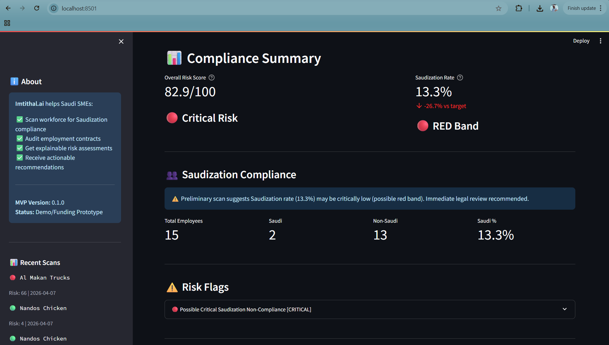

# ⚖️ Imtithal.ai — AI Compliance Copilot for Saudi SMEs

**Compliance Intelligence for Saudization (Nitaqat) and Employment Contracts**

---

## 🎥 Demo Video

👉 https://youtu.be/9uBNKj5Aa1M

---

## 📸 Example Output



---

## 📌 Overview

Imtithal.ai is an AI-powered compliance copilot designed to help Saudi SMEs proactively assess and manage regulatory risk.

The system analyzes:
- Workforce composition for **Saudization (Nitaqat) compliance**
- Employment contracts for **labor law risks and violations**

It delivers **explainable risk scores**, **flagged violations**, and **actionable recommendations** — enabling businesses to identify compliance gaps before they become costly penalties.

---

## 🧠 Problem Statement

Saudi SMEs face increasing regulatory pressure under Vision 2030, particularly around:

- Saudization quotas (Nitaqat bands)
- Employment contract compliance
- Labor law enforcement (Qiwa ecosystem)

Most businesses operate **reactively**, discovering issues only after:
- Fines are issued
- Audits are triggered
- Legal disputes arise

---

## 💡 Solution

Imtithal.ai acts as a **“Regulatory Guardrail”**, enabling:

✔ Pre-audit compliance scanning  
✔ Workforce Saudization analysis  
✔ Contract risk detection (missing clauses + toxic terms)  
✔ Explainable risk scoring  
✔ Actionable remediation steps  

---

## 🏗️ Architecture

**Backend**
- FastAPI (REST API)
- Rule-based compliance engine (deterministic logic)
- PDF parsing + text extraction

**Frontend**
- Streamlit (interactive UI for compliance scanning)

**Core Modules**
- `nitaqat_engine.py` → Saudization threshold evaluation
- `roster_analyzer.py` → workforce parsing & validation
- `document_auditor.py` → contract risk detection
- `report_builder.py` → structured compliance outputs

---

## ⚙️ Features

### 1. Saudization Compliance Engine
- Calculates Saudi vs non-Saudi workforce ratio
- Maps results to **Green / Yellow / Red bands**
- Detects critical non-compliance scenarios

---

### 2. Contract Risk Auditor
Detects:

**Missing Required Clauses**
- Probation period
- Termination notice
- Salary details
- Leave policies
- Job description

**High-Risk / Illegal Terms**
- “Waive rights”
- “Unlimited working hours”
- “No annual leave”
- “Immediate termination without notice”
- “No compensation / unpaid overtime”

---

### 3. Explainable Risk Output
- Risk score (0–100)
- Compliance band classification
- Structured findings (LOW / MEDIUM / HIGH / CRITICAL)
- Clear recommended actions

---

## 🧪 Demonstration Scenarios

### 🟢 Scan 001 — Green Band (Compliant)
- 66.7% Saudization
- Low risk
- Minor contract issues

---

### 🔴 Scan 002 — Parser Edge Case
- CSV formatting issue triggered
- Demonstrates **data validation layer**
- System correctly flags ingestion failure

---

### 🔴 Scan 003 — Red Band (Critical Scenario)
- 13.3% Saudization
- Multiple labor law violations
- High-risk contract clauses detected
- System recommends immediate legal intervention

---

## 📂 Project Structure


```

imtithal-ai/
│
├── app/
│   ├── main.py
│   ├── streamlit_app.py
│   ├── routers/
│   ├── services/
│   ├── models/
│   └── utils/
│
├── data/
│   ├── rules/
│   └── uploads/
│
├── evidence/
│   ├── reports/
│   ├── screenshots/
│   └── scans/
│
├── requirements.txt
└── README.md

```

---

## 🚀 How to Run

### 1. Install dependencies
```bash
pip install -r requirements.txt
```

### 2. Start backend

```bash
uvicorn app.main:app --reload
```

### 3. Start frontend

```bash
streamlit run app/streamlit_app.py
```

---

## 📊 Sample Output

The system produces:

* Compliance score (e.g. **82.9 / 100 — Critical Risk**)
* Saudization classification (**RED Band**)
* Contract violations (structured findings)
* Actionable remediation steps

---

## ⚠️ Disclaimer

This is an MVP demonstration using mock regulatory thresholds.

Results are **not legal advice** and should be validated with qualified Saudi labor law professionals.

---

## 🧭 Strategic Positioning

Imtithal.ai is designed as a **low-cost, high-impact compliance layer** for SMEs, aligned with:

* Saudi Vision 2030
* Workforce nationalization policies
* Increasing regulatory enforcement

---

## 👤 Author

**Alvin Siphosenkosi Moyo**
Applied AI Engineer | Regulated Finance Specialist

* 16+ years in finance, treasury, and compliance environments
* Transitioning into applied AI and decision intelligence systems

---

## 📣 Final Note

This project demonstrates:

* Real-world problem framing (regulatory + financial risk)
* Deterministic AI system design (rule-based + explainable)
* End-to-end delivery (UI → backend → reporting)

```
